# DeFi Empire Smart Contract

## Overview

This smart contract allows players to collect, build, and earn rewards for their participation in the game's activities.

- It has two main contracts, `ERC20` token contract and the `Vault` contract

- The ERC20-Token contract, `src/ERC20.sol`, was deployed on the `marsSubnet` network at the contract address `0x5DB9A7629912EBF95876228C24A848de0bfB43A9` and
- The Vault contract, `src/Vault.sol` was deployed on the `marsSubnet` network at the contract address`0xa4DfF80B4a1D748BF28BC4A271eD834689Ea3407`.

## Table of Contents

- [DeFi Empire Smart Contract](#defi-empire-smart-contract)
  - [Overview](#overview)
  - [Table of Contents](#table-of-contents)
  - [Deploying my EVM subnet using the Avalanche CLI](#deploying-my-evm-subnet-using-the-avalanche-cli)
  - [Added Subnet to Metamask and Connected to Injected Provider](#added-subnet-to-metamask-and-connected-to-injected-provider)
  - [Deploying the Smart contract using Foundry](#deploying-the-smart-contract-using-foundry)
    - [The ERC20-TOken and Vault Contract](#the-erc20-token-and-vault-contract)
  - [Contract Details](#contract-details)
  - [Vault Contract Functionalities](#vault-contract-functionalities)
    - [Deposit](#deposit)
    - [Withdraw](#withdraw)
    - [ERC-20 Interface](#erc-20-interface)
  - [Interacting with the deployed contracts address](#interacting-with-the-deployed-contracts-address)
    - [Interacting with the ERC20 token contract](#interacting-with-the-erc20-token-contract)
    - [Interacting with the Vault contract](#interacting-with-the-vault-contract)
  - [Usage Guidelines](#usage-guidelines)
  - [Demo Videos](#demo-videos)
  - [Author](#author)
  - [Disclaimer](#disclaimer)

## Deploying my EVM subnet using the Avalanche CLI

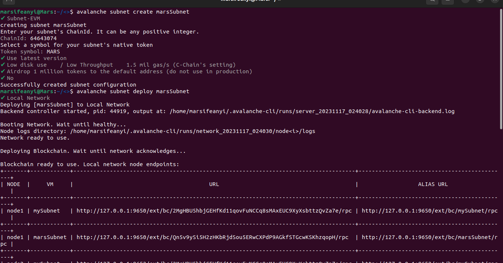

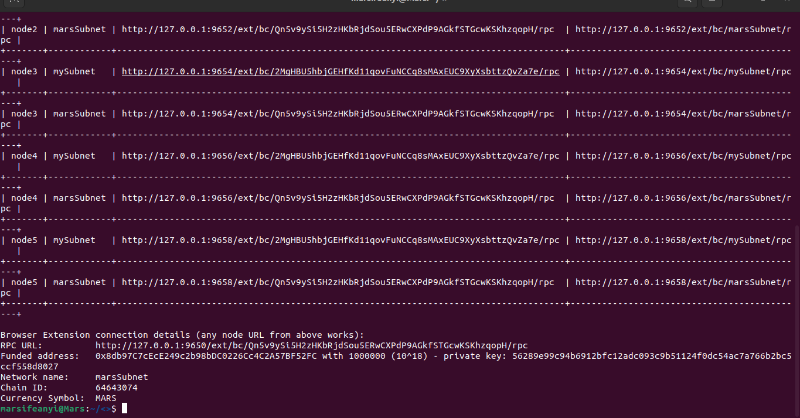

## Added Subnet to Metamask and Connected to Injected Provider

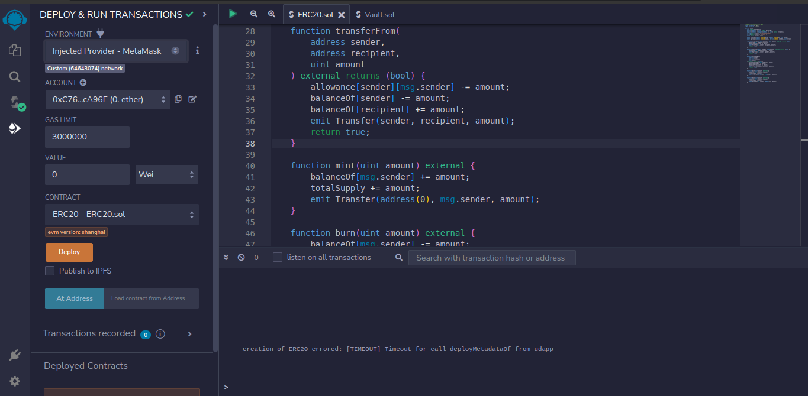

## Deploying the Smart contract using Foundry

- **`ERC20.sol`**

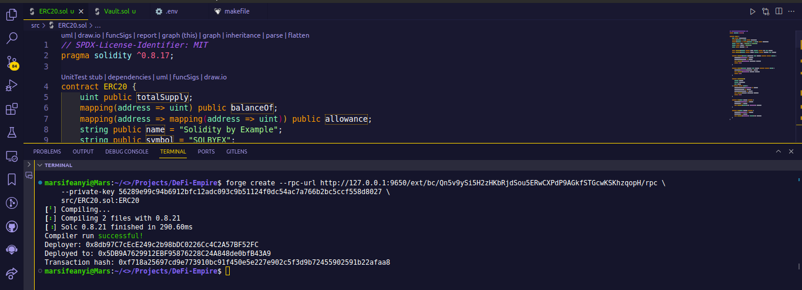

- **`Vault.sol`**

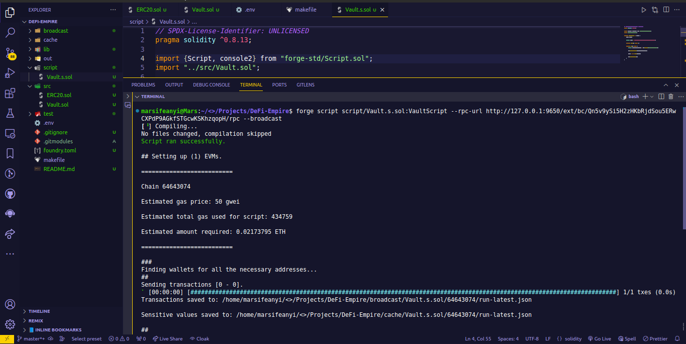

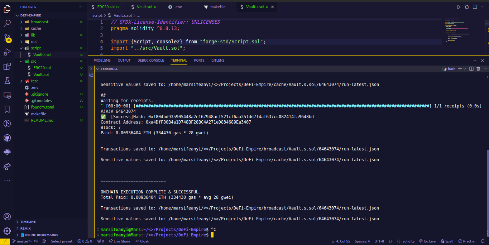

### The ERC20-TOken and Vault Contract

- The ERC20-Token contract, `src/ERC20.sol`, was deployed on the `marsSubnet` network at the contract address `0x5DB9A7629912EBF95876228C24A848de0bfB43A9` and
- The Vault contract, `src/Vault.sol` was deployed on the `marsSubnet` network at the contract address`0xa4DfF80B4a1D748BF28BC4A271eD834689Ea3407`.
- The vault contract is used for managing deposits and withdrawals of a specified ERC-20 token.
- It has functionalities that allows users to deposit tokens, minting shares in proportion to the deposited amount, and later withdraw a corresponding amount of tokens based on the shares they hold.

## Contract Details

- **Contract Address:** `0xa4DfF80B4a1D748BF28BC4A271eD834689Ea3407`
- **Network:** marsSubnet
- **Chain ID** 64643074
- **Currency Symbol** MARS
- **License:** MIT

## Vault Contract Functionalities

### Deposit

- The `deposit()` function allows users to deposit ERC-20 tokens into the vault.

- This function calculates the number of shares to mint based on the deposited amount and the current total supply of shares.

```solidity
function deposit(uint _amount) external {
        uint shares;
        if (totalSupply == 0) {
            shares = _amount;
        } else {
            shares = (_amount * totalSupply) / token.balanceOf(address(this));
        }

        _mint(msg.sender, shares);
        token.transferFrom(msg.sender, address(this), _amount);
    }

```

### Withdraw

- The `withdraw` function allows users to withdraw their tokens from the vault.
- This function calculates the amount to withdraw based on the number of shares burned and the current total supply of shares.

```solidity
function withdraw(uint _shares) external {
        uint amount = (_shares * token.balanceOf(address(this))) / totalSupply;
        _burn(msg.sender, _shares);
        token.transfer(msg.sender, amount);
    }
```

### ERC-20 Interface

The ERC20 interface provides the functions signatures basic token operations like checking balances, transferring tokens, and approving token transfers.

```solidity
interface IERC20 {
    function totalSupply() external view returns (uint);

    function balanceOf(address account) external view returns (uint);

    function transfer(address recipient, uint amount) external returns (bool);

    function allowance(
        address owner,
        address spender
    ) external view returns (uint);

    function approve(address spender, uint amount) external returns (bool);

    function transferFrom(
        address sender,
        address recipient,
        uint amount
    ) external returns (bool);

    event Transfer(address indexed from, address indexed to, uint value);
    event Approval(address indexed owner, address indexed spender, uint value);
}
```

## Interacting with the deployed contracts address

### Interacting with the ERC20 token contract

- Initial State


- Minting tokens

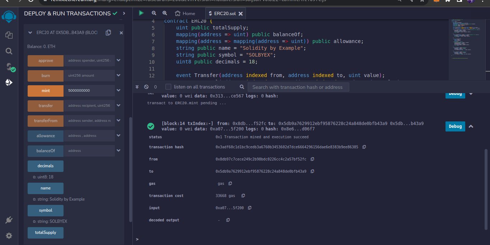

- Burning tokens

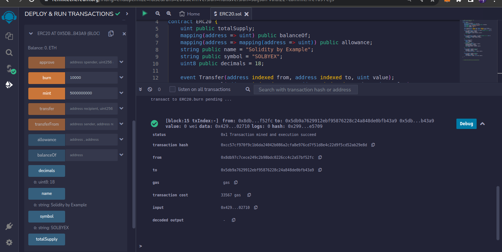

- Approving the Vault contract to spend 100000 units of the ERC20 token

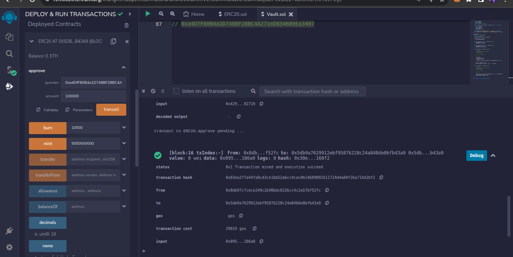

### Interacting with the Vault contract

- Depositing 10000 units of the ERC20 token on the Vault

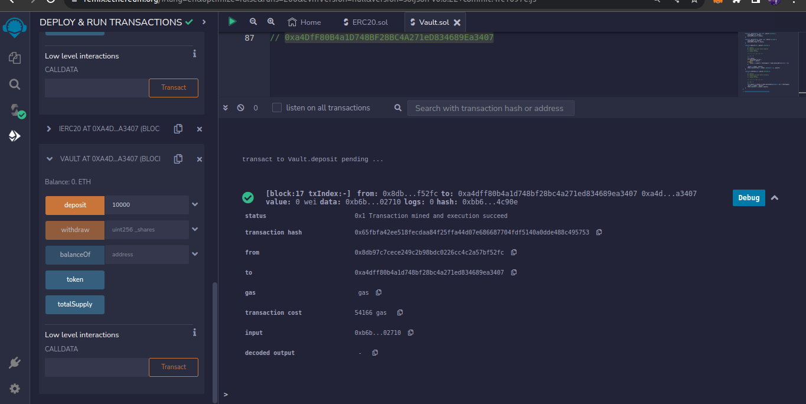

- Checking Balance after deposit

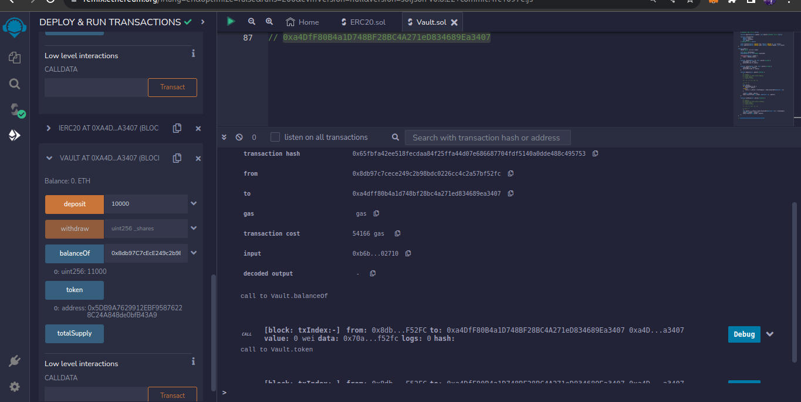

- Withdrawing

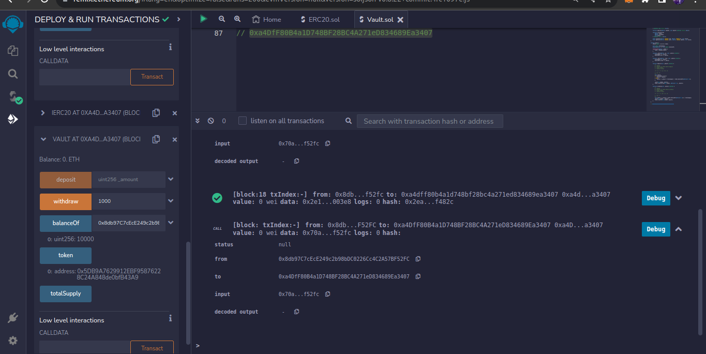

- Checking Balance After Withdrawal

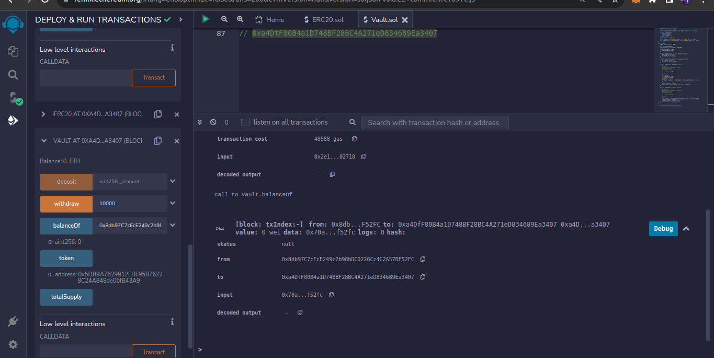

## Usage Guidelines

1. **Token Approval:**
   Before depositing, ensure that you have approved the contract to spend your ERC20 tokens. Use the ERC20 `approve` function to grant the necessary permission.

```solidity
function approve(address spender, uint amount) external returns (bool);
```

2. **Deposit:**
   Call the `deposit` function with the desired amount of tokens to mint corresponding shares.

3. **Withdraw:**
   Call the `withdraw` function with the number of shares to burn and receive the proportional amount of tokens.

4. **Monitor Balances:**
   Keep track of your token balances and shares to manage deposits and withdrawals effectively, by calling the `balanceOf()`

   ```solidity
   function balanceOf(address account) external view returns (uint);
   ```

## Demo Videos

https://www.loom.com/share/c27c0fb724974177ad407bcead436d1e?sid=7c09cd67-4ef5-4547-b12a-7a4557b521a1

https://www.loom.com/share/6e7fa57107714ac2b544bf122a91351d?sid=3360f4f6-1079-4ac0-b064-386201829daa

## Author

Marcellus Ifeanyi
[@metacraftersio](https://twitter.com/Mars_Energy)

## Disclaimer

- This smart contract is provided under the MIT license, and users are encouraged to review and understand the code before interacting with it, also this contract is deployed on `marsSubnet` Network (my EVM subnet using the Avalanche CLI).
